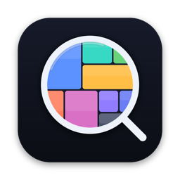
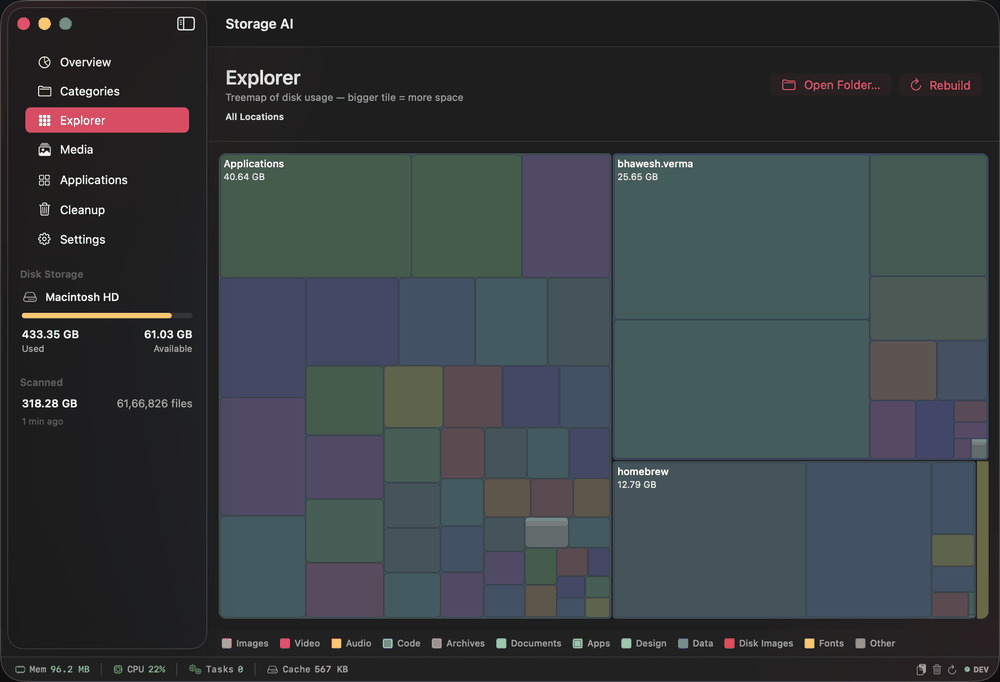
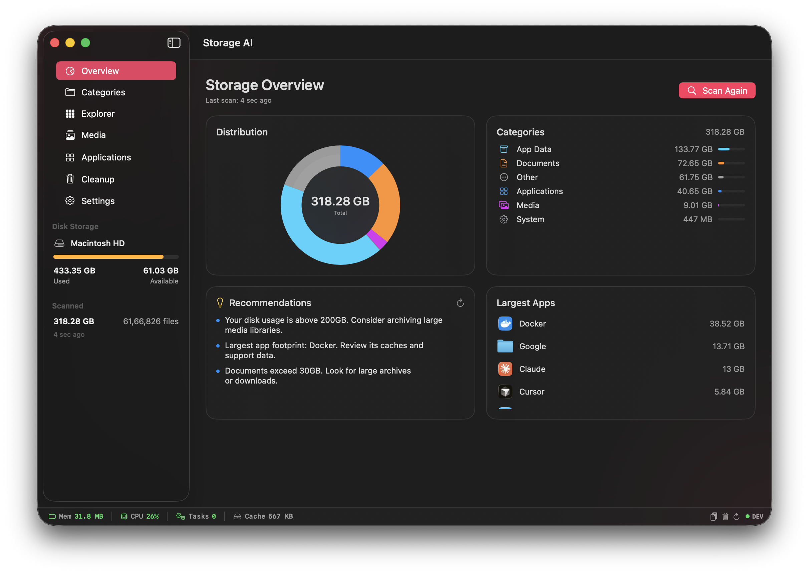
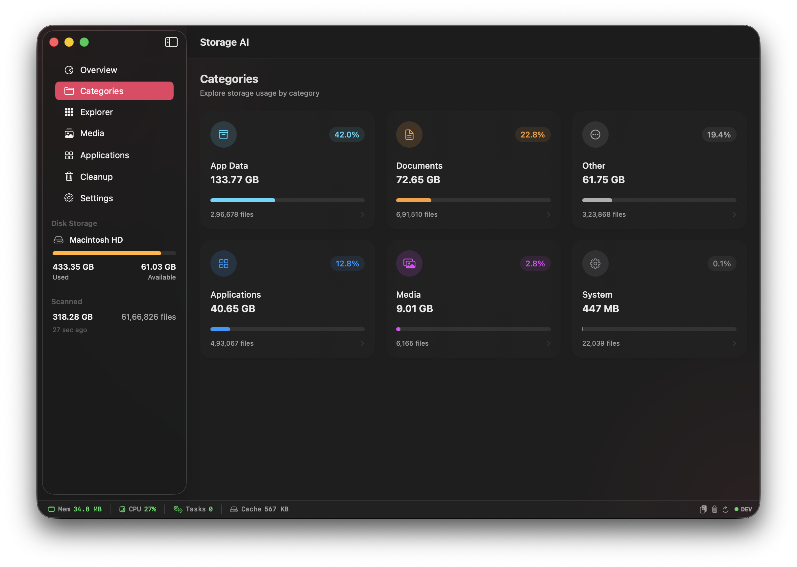
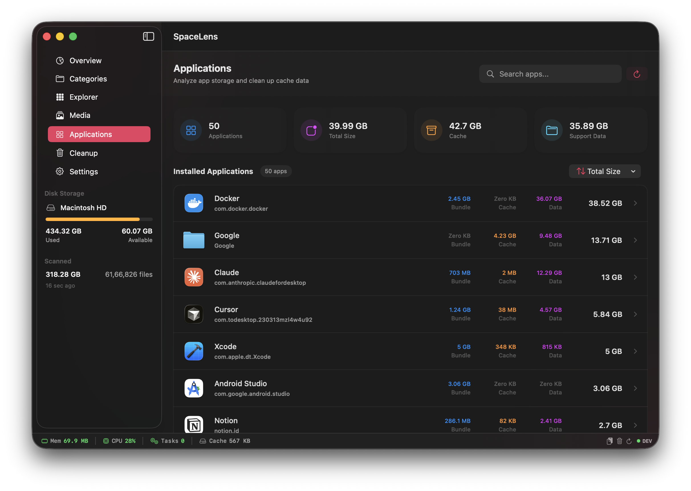
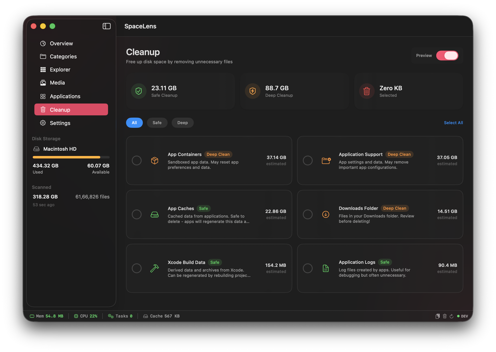
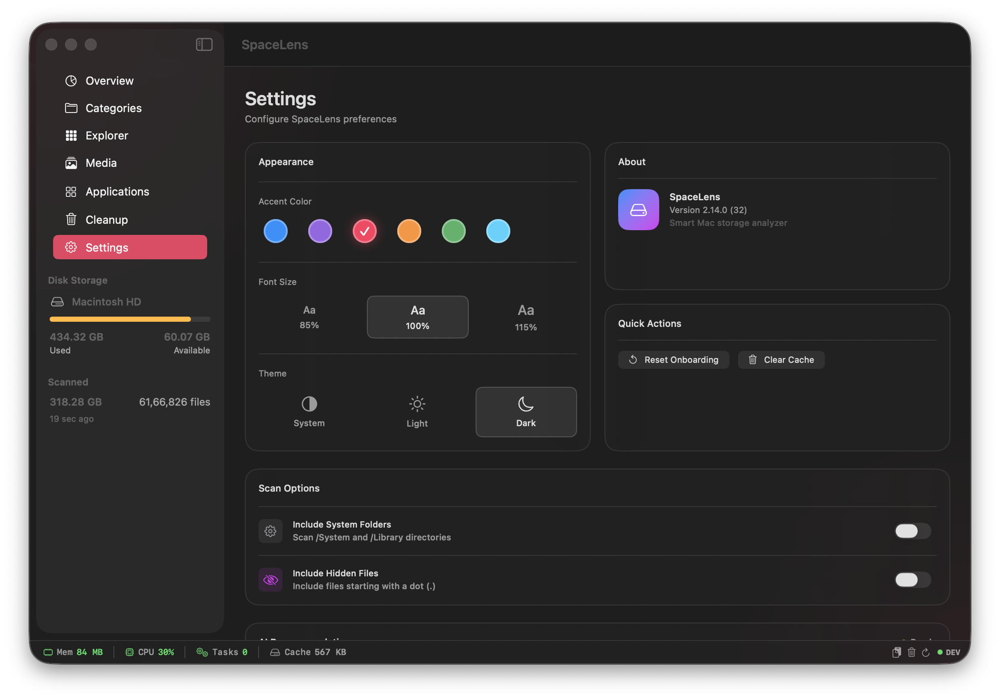

<div align="center">



# SpaceLens

### See where your space went — and take it back

[](https://www.apple.com/macos/)
[](https://swift.org/)
[](https://developer.apple.com/xcode/swiftui/)
[](LICENSE)
[](../../releases/latest)

<br/>

**SpaceLens** is a beautiful, native macOS app that helps you understand and reclaim your disk space. Powered by intelligent file categorization and optional local AI recommendations via Ollama.

[Download Latest Release](../../releases/latest) · [Read the engineering write-up](https://bhaweshv.vercel.app/post/mapping-a-million-files) · [Report Bug](../../issues) · [Request Feature](../../issues)

<br/>

---

</div>

## ✨ Features

<table>
<tr>
<td width="50%">

### 🗺 Treemap Explorer
- **GrandPerspective-style treemap** of your whole disk
- **Drill down** into any folder with breadcrumbs
- **Hover** for details, right-click to Reveal or Trash
- **Color-coded** — stable folder hues + 12 file-type colors
- **Fast & lean** — one ~30s walk, lazy levels, tiny footprint
- **Open any folder** to map just that subtree

</td>
<td width="50%">

### 🔍 Smart Scanning
- **Lightning-fast** file system analysis
- **Intelligent categorization** into 6 categories
- **Real-time progress** with live file counts & sizes
- **Time estimation** - shows remaining scan time
- **Pause & Resume** - continue scans anytime
- **Auto-save** - progress saved every 60 seconds

</td>
</tr>
<tr>
<td width="50%">

### 🎨 Beautiful Interface
- **Native SwiftUI** design
- **6 accent color themes** to match your style
- **Light/Dark mode** support
- **Adjustable font sizes** for accessibility
- **Menu bar extra** - quick disk status at a glance

</td>
<td width="50%">

### 🧹 Cleanup Tools
- **Safe cleanup** recommendations
- **Cache cleaning** for apps and system
- **Xcode cleanup** (derived data, archives)
- **Log file** management
- **One-click cleanup** with size estimates
- **App-specific cleanup** - clean cache, data, or uninstall

</td>
</tr>
<tr>
<td width="50%">

### 🤖 AI-Powered (Optional)
- **Auto-setup Ollama** on first launch
- **Local Ollama** integration
- **Grounded recommendations** based on your actual scan
- **Privacy-first** - all processing stays on device
- **Works offline** - no cloud dependency

</td>
<td width="50%">

### 🛡 Safe by Design
- **Never permanently deletes** — everything goes to Trash
- **Safety allowlists** refuse system paths & volume roots
- **Honest reporting** — real freed sizes and failure reasons
- **Stable signing** — permissions persist across updates
- **Skips Photos/Music libraries** — app-managed media untouched

</td>
</tr>
</table>

## 🆕 What's New in v2.13.0

- **🗺 Treemap Explorer** - GrandPerspective-style visual map of your disk with drill-down, hover info, Reveal in Finder, and Move to Trash
- **🎨 Color-coded everything** - stable per-folder hues plus 12 file-type colors (now incl. Design, Data, Disk Images, Fonts)
- **📊 Live category drill-down** - file lists fill in *during* scans and survive interrupted scans
- **🗑 Honest deletes** - real freed-space numbers (no more "Zero KB"), failure reasons, and an apps-list Refresh button
- **🔐 Permissions that stick** - stable code signing means macOS stops re-asking for folder access after every update
- **🎵 Media-library safe** - analysis skips Photos/Music libraries, eliminating the Apple Music permission prompt
- **🛠 66-finding deep review** - security, performance, state-management, and accessibility fixes across the app, backed by 46 unit tests

See the full [CHANGELOG](CHANGELOG.md) for details.

## 📸 Screenshots

<div align="center">

### Treemap Explorer


*One picture of your whole disk — bigger tile = more space. Click folders to drill in, hover for details.*

---

### Storage Overview


*Disk usage at a glance with AI-powered recommendations and your largest apps.*

---

### Categories


*Six storage categories with live file counts — click any card for the file-level breakdown.*

---

### Applications


*Every app with its bundle, cache, and data sizes — clean caches, remove app data, or uninstall.*

---

### Cleanup


*Safe, one-click cleanup targets with size estimates — everything goes to the Trash, nothing is permanently deleted.*

---

### Settings


*Themes, font sizes, scan locations, and local AI configuration with Ollama.*

---

</div>

## 🚀 Installation

### Download DMG (Recommended)

1. Download the latest DMG from [Releases](../../releases/latest)
2. Open the DMG file
3. Drag **SpaceLens** to your Applications folder
4. Launch from Applications or Spotlight

### Build from Source

```bash
# Clone the repository
git clone https://github.com/bhaweshverma50/spacelens.git
cd spacelens

# Build release version
swift build -c release

# Build + sign + install straight into /Applications (recommended for local use —
# signs with your certificate so macOS permission grants persist across rebuilds)
./scripts/dev-install.sh

# Or create a DMG installer
./scripts/create-dmg.sh
```

## 📖 Usage

### First Launch

1. **Grant Permissions** - SpaceLens needs Full Disk Access to scan your files
2. **Optional AI Setup** - Enable Ollama for smart recommendations (auto-installs if needed)
3. **Start Scan** - Click the scan button to analyze your disk
4. **Explore Categories** - Click any category to see detailed file lists
5. **Clean Up** - Use the cleanup tools to reclaim space

### File Categories

| Category | Description |
|----------|-------------|
| 📱 **Applications** | Apps in /Applications and .app bundles |
| 📄 **Documents** | Files in Documents, Desktop, Downloads |
| 🎬 **Media** | Movies, Music, Pictures, and media files |
| ⚙️ **System** | System files, libraries, and binaries |
| 📚 **Libraries** | App caches, containers, and support files |
| 📦 **Other** | Everything else |

### AI Recommendations (Optional)

SpaceLens can automatically set up Ollama for you:

1. Go to **Settings** or enable during onboarding
2. Click **Set Up Ollama** 
3. SpaceLens will download, install, and configure Ollama automatically
4. Get intelligent cleanup suggestions powered by local AI

Or manually install:
1. Install [Ollama](https://ollama.ai) on your Mac
2. Pull a model: `ollama pull llama3.2`
3. Enable Ollama in SpaceLens Settings

## 🛠 Requirements

- **macOS 14.0+** (Sonoma or later)
- **Apple Silicon or Intel** Mac
- **Full Disk Access** permission
- **Optional:** ~4GB disk space for Ollama AI features

## 🏗 Architecture

```
SpaceLens/
├── Models/
│   ├── AppState.swift        # Central state management
│   └── StorageModels.swift   # Data models
├── Services/
│   ├── ScanService.swift     # Scan orchestration
│   ├── FileIndexer.swift     # File system traversal
│   ├── ScanDataStore.swift   # Persistence layer
│   ├── CleanupService.swift  # Cleanup target discovery
│   ├── DeleteEngine.swift    # Trash-only deletes with safety allowlists
│   ├── FileTreeBuilder.swift # Treemap size index (lazy, memory-bounded)
│   ├── TreemapLayout.swift   # Squarified treemap algorithm
│   ├── OllamaClient.swift    # AI integration
│   └── OllamaSetupService.swift # Auto AI setup
└── Views/
    ├── DashboardView.swift   # Main interface
    ├── ExplorerView.swift    # Treemap canvas & interactions
    ├── CategoryDetailView.swift
    ├── AppDetailView.swift   # App details & cleanup
    ├── CleanupView.swift
    ├── SettingsView.swift
    └── OllamaSetupSheet.swift
```

### Key Technologies

- **SwiftUI** - Modern declarative UI
- **Combine** - Reactive state management
- **Swift Concurrency** - Async/await for smooth performance
- **Actor Isolation** - Thread-safe data operations

## 🤝 Contributing

Contributions are welcome! Please feel free to submit a Pull Request.

1. Fork the repository
2. Create your feature branch (`git checkout -b feature/AmazingFeature`)
3. Commit your changes (`git commit -m 'Add some AmazingFeature'`)
4. Push to the branch (`git push origin feature/AmazingFeature`)
5. Open a Pull Request

## 📝 License

This project is licensed under the MIT License - see the [LICENSE](LICENSE) file for details.

## 🙏 Acknowledgments

- Built with [SwiftUI](https://developer.apple.com/xcode/swiftui/)
- AI powered by [Ollama](https://ollama.ai)
- Icons from [SF Symbols](https://developer.apple.com/sf-symbols/)

---

<div align="center">

**Made with ❤️ for macOS**

⭐ Star this repo if you find it useful!

</div>
