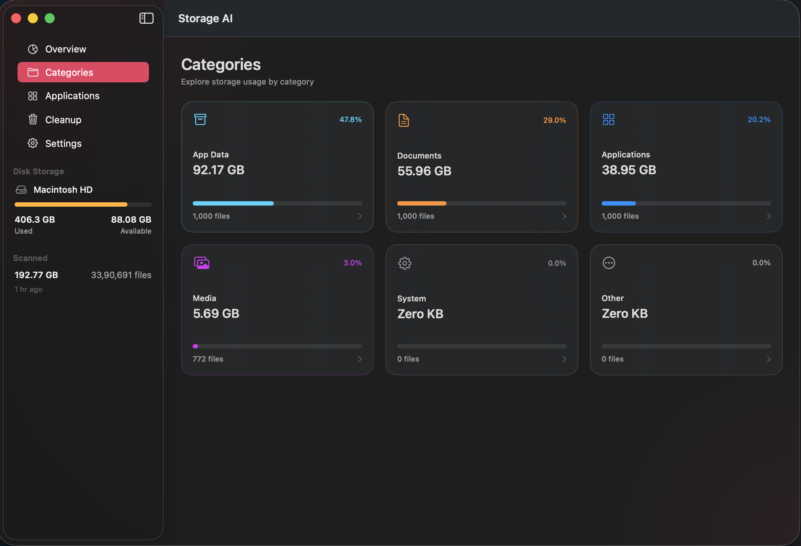
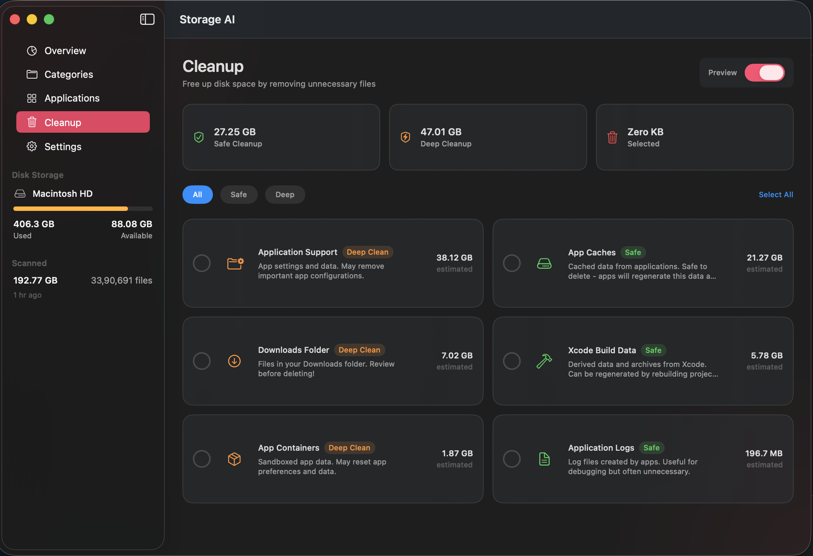
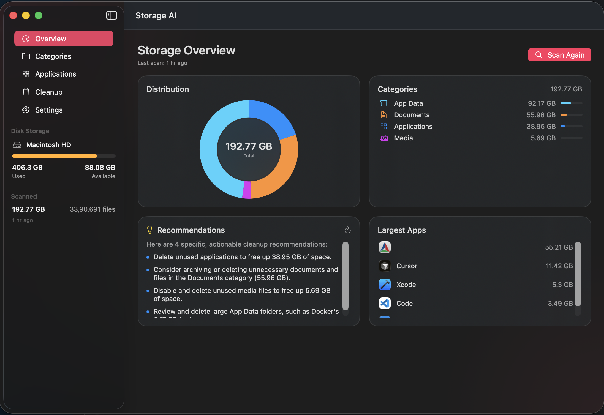
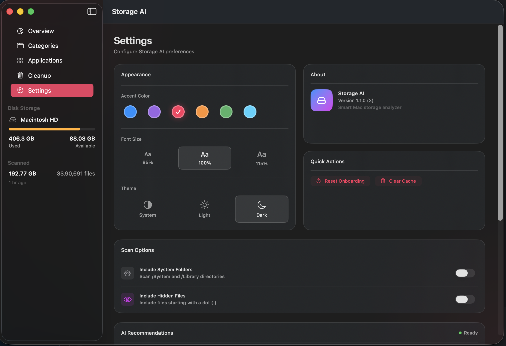
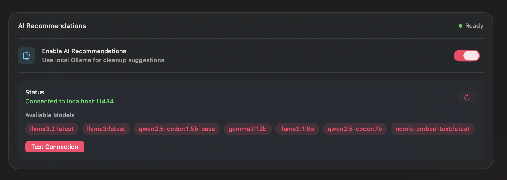
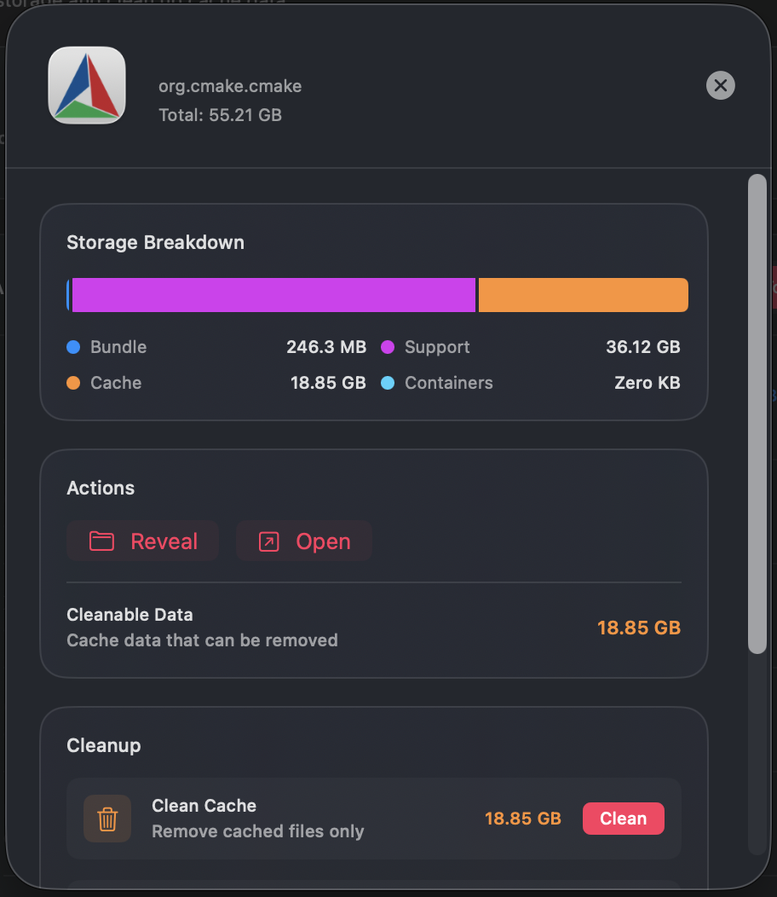

<div align="center">

# Storage AI

### Intelligent Disk Space Analyzer for macOS

[](https://www.apple.com/macos/)
[](https://swift.org/)
[](https://developer.apple.com/xcode/swiftui/)
[](LICENSE)
[](../../releases/latest)

<br/>

**Storage AI** is a beautiful, native macOS app that helps you understand and reclaim your disk space. Powered by intelligent file categorization and optional local AI recommendations via Ollama.

[Download Latest Release](../../releases/latest) · [Report Bug](../../issues) · [Request Feature](../../issues)

<br/>

---

</div>

## ✨ Features

<table>
<tr>
<td width="50%">

### 🔍 Smart Scanning
- **Lightning-fast** file system analysis
- **Intelligent categorization** into 6 categories
- **Real-time progress** with live file counts & sizes
- **Time estimation** - shows remaining scan time
- **Pause & Resume** - continue scans anytime
- **Auto-save** - progress saved every 60 seconds

</td>
<td width="50%">

### 🎨 Beautiful Interface
- **Native SwiftUI** design
- **6 accent color themes** to match your style
- **Light/Dark mode** support
- **Adjustable font sizes** for accessibility
- **Menu bar extra** - quick disk status at a glance

</td>
</tr>
<tr>
<td width="50%">

### 🧹 Cleanup Tools
- **Safe cleanup** recommendations
- **Cache cleaning** for apps and system
- **Xcode cleanup** (derived data, archives)
- **Log file** management
- **One-click cleanup** with size estimates
- **App-specific cleanup** - clean cache, data, or uninstall

</td>
<td width="50%">

### 🤖 AI-Powered (Optional)
- **Auto-setup Ollama** on first launch
- **Local Ollama** integration
- **Smart recommendations** for what to delete
- **Privacy-first** - all processing stays on device
- **Works offline** - no cloud dependency

</td>
</tr>
</table>

## 🆕 What's New in v2.4.0

- **🧹 App Cleanup Actions** - Clean cache, remove app data, or uninstall apps directly from app details
- **👆 Clickable App Rows** - Click anywhere on an application row to see details
- **🎨 Custom App Icon** - Beautiful new app icon for Storage AI
- **⚡ Auto Ollama Setup** - Automatic download, install, and model setup for AI features
- **🔧 Bug Fixes** - Fixed applications and cleanup data loading from cache on restart
- **⏱️ Time Estimation** - See estimated time remaining during scans
- **📊 Live File Counts** - Real-time file counts per category while scanning
- **⏸️ Pause & Resume** - Stop scans and continue where you left off
- **💾 Auto-Save Progress** - Scan progress saved automatically every 60 seconds
- **🖥️ Menu Bar Extra** - Quick access to disk usage from the menu bar

## 📸 Screenshots

<div align="center">

### Categories View


*Drill down into each storage category to see detailed file breakdowns.*

---

### Cleanup View


*Identify and clean up caches, logs, Xcode data, and other recoverable space.*

---

### Overview


*Quick access to disk usage and storage breakdown and everything else here*

---

### Settings View


*Customize themes, font sizes, and configure AI-powered recommendations with Ollama.*

---

### AI Options


---

### Application details


*Click any app to see detailed storage breakdown and cleanup options - clean cache, remove data, or uninstall.*

---

</div>

## 🚀 Installation

### Download DMG (Recommended)

1. Download the latest DMG from [Releases](../../releases/latest)
2. Open the DMG file
3. Drag **Storage AI** to your Applications folder
4. Launch from Applications or Spotlight

### Build from Source

```bash
# Clone the repository
git clone https://github.com/yourusername/storage-ai.git
cd storage-ai

# Build release version
swift build -c release

# Or create a DMG installer
./scripts/create-dmg.sh
```

## 📖 Usage

### First Launch

1. **Grant Permissions** - Storage AI needs Full Disk Access to scan your files
2. **Optional AI Setup** - Enable Ollama for smart recommendations (auto-installs if needed)
3. **Start Scan** - Click the scan button to analyze your disk
4. **Explore Categories** - Click any category to see detailed file lists
5. **Clean Up** - Use the cleanup tools to reclaim space

### File Categories

| Category | Description |
|----------|-------------|
| 📱 **Applications** | Apps in /Applications and .app bundles |
| 📄 **Documents** | Files in Documents, Desktop, Downloads |
| 🎬 **Media** | Movies, Music, Pictures, and media files |
| ⚙️ **System** | System files, libraries, and binaries |
| 📚 **Libraries** | App caches, containers, and support files |
| 📦 **Other** | Everything else |

### AI Recommendations (Optional)

Storage AI can automatically set up Ollama for you:

1. Go to **Settings** or enable during onboarding
2. Click **Set Up Ollama** 
3. Storage AI will download, install, and configure Ollama automatically
4. Get intelligent cleanup suggestions powered by local AI

Or manually install:
1. Install [Ollama](https://ollama.ai) on your Mac
2. Pull a model: `ollama pull llama3.2`
3. Enable Ollama in Storage AI Settings

## 🛠 Requirements

- **macOS 14.0+** (Sonoma or later)
- **Apple Silicon or Intel** Mac
- **Full Disk Access** permission
- **Optional:** ~4GB disk space for Ollama AI features

## 🏗 Architecture

```
StorageAI/
├── Models/
│   ├── AppState.swift        # Central state management
│   └── StorageModels.swift   # Data models
├── Services/
│   ├── ScanService.swift     # Scan orchestration
│   ├── FileIndexer.swift     # File system traversal
│   ├── ScanDataStore.swift   # Persistence layer
│   ├── CleanupService.swift  # Cleanup operations
│   ├── OllamaClient.swift    # AI integration
│   └── OllamaSetupService.swift # Auto AI setup
└── Views/
    ├── DashboardView.swift   # Main interface
    ├── CategoryDetailView.swift
    ├── AppDetailView.swift   # App details & cleanup
    ├── CleanupView.swift
    ├── SettingsView.swift
    └── OllamaSetupSheet.swift
```

### Key Technologies

- **SwiftUI** - Modern declarative UI
- **Combine** - Reactive state management
- **Swift Concurrency** - Async/await for smooth performance
- **Actor Isolation** - Thread-safe data operations

## 🤝 Contributing

Contributions are welcome! Please feel free to submit a Pull Request.

1. Fork the repository
2. Create your feature branch (`git checkout -b feature/AmazingFeature`)
3. Commit your changes (`git commit -m 'Add some AmazingFeature'`)
4. Push to the branch (`git push origin feature/AmazingFeature`)
5. Open a Pull Request

## 📝 License

This project is licensed under the MIT License - see the [LICENSE](LICENSE) file for details.

## 🙏 Acknowledgments

- Built with [SwiftUI](https://developer.apple.com/xcode/swiftui/)
- AI powered by [Ollama](https://ollama.ai)
- Icons from [SF Symbols](https://developer.apple.com/sf-symbols/)

---

<div align="center">

**Made with ❤️ for macOS**

⭐ Star this repo if you find it useful!

</div>
